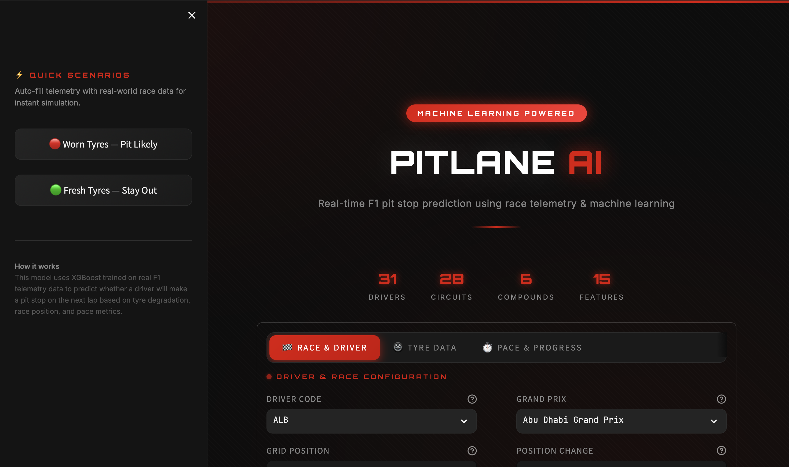

# 🏁 F1 Pit Stop Predictor

A robust, machine learning-powered web application that predicts whether a Formula 1 driver will pit on the next lap based on live race telemetry.

## 📸 Screenshots




## 🚀 Features

- **Advanced ML Pipeline**: Built using an XGBoost Classifier engineered specifically for time-series race data.
- **Data Leakage Prevention**: Trained using `GroupShuffleSplit` on race events to ensure the model generalizes perfectly to entirely new and unseen races.
- **Handling Class Imbalance**: Predicts rare pit stop events with high recall (85%) by explicitly penalizing false negatives via `scale_pos_weight`.
- **Rolling Time-Series Features**: Uses rolling lap time averages and lap time gradients to evaluate a driver's true degradation curve.
- **Sleek Web Interface**: Features a premium, dark-mode, F1-styled Streamlit application.

## 🛠️ Installation & Usage

1. Clone the repository.
2. Install the requirements:
   ```bash
   pip install -r requirements.txt
   ```
3. Run the Streamlit web application:
   ```bash
   streamlit run app.py
   ```

## 🧠 Model Architecture
- **Algorithm**: XGBoost
- **Feature Engineering**: Pandas grouping (3-lap rolling averages, LapTime gradients).
- **Hyperparameter Optimization**: Randomized Grid Search (`n_estimators`, `max_depth`, `learning_rate`).

